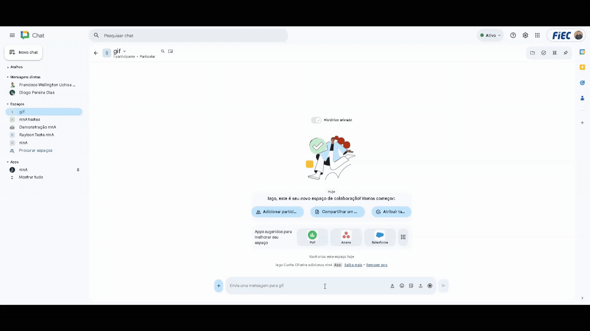
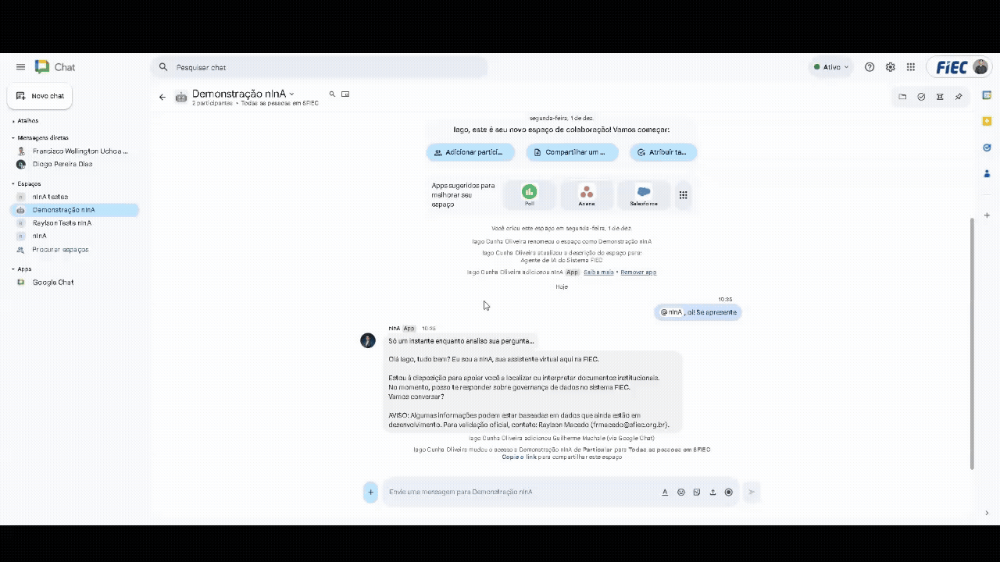

# nInA — Documentação de Uso  
Agente de IA do Sistema FIEC

## 📌 Introdução

A **nInA** (Núcleo de Inteligência e Navegação Automatizada) é uma agente de IA e assistente virtual inteligente desenvolvida para ser uma fonte de consulta rápida e consistente de informações.
 
Atualmente a nInA pode responder sobre as **políticas, normas e documentos internos** do Sistema FIEC.
 
Em breve, a nInA terá sua capacidade expandida para conversar sobre qualquer coisa que você desejar.

**Propósito:** Interpretar e explicar documentos internos, garantindo uniformidade e precisão.  
**Motivação:** Reduzir dúvidas recorrentes e inconsistências de interpretação.  
**Valor do MVP:** Menos carga operacional, consulta padronizada e maior agilidade no dia a dia.  
**Público-Alvo Inicial:** Time interno do Observatório e usuários que trabalham com políticas e normas internas.

---

## 🛠️ Como Usar a nInA no Google Chat

A nInA está integrada ao Google Chat e pode ser usada em **grupos** ou **conversas individuais**.

---

### 💬 Uso em Grupos / Espaços (Recomendado)

1. Acesse o espaço onde a nInA já está adicionada.  
   Exemplo de espaço de testes:  
   `https://chat.google.com/room/AAQAoqGdYcM?cls=1`

2. Para fazê-la responder, mencione:  
   **@nInA (Agente de IA do Sistema FIEC)**

3. Escreva sua pergunta e envie.

A nInA responderá no mesmo espaço, te mencionando.

---

### 👤 Uso em Conversa Individual (DM)

#### Como acessar

**Método atual (teste):**
- Clique no avatar da nInA dentro do espaço de testes.
- Selecione **Instalar aplicativo** → você será levado ao chat privado.

**Método oficial (próximo passo):**
- Acesse a aba **APPS** no Google Chat.
- Pesquise por **"nInA (Agente de IA do Sistema FIEC)"**.
- Abra o app para iniciar a conversa privada.

#### Como usar no DM
- Basta enviar sua pergunta.
- Não precisa mencionar @nInA em conversas privadas.

---

## 💡 Exemplos de Uso (Perguntas e Respostas)

| Pergunta | Resposta Esperada | Documento Base |
|----------|-------------------|----------------|
| "Quais são os princípios orientadores da política de qualidade?" | Resumo claro dos princípios de qualidade de dados | Política de Qualidade de Dados |
| "Quais são os campos de metadados da FIEC?" | Lista completa e descrições dos campos de metadados | Norma de Uso de Metadados Institucionais |
| "Como faço para criar um novo termo no glossário?" | Explicação do fluxo e campos necessários para criação | Modelo de Formulário + Norma de Glossário |
| "O que é ciclo de vida do dado?" | Definição conceitual e descrição das etapas | Política de Ciclo de Vida de Dados |

---

## 🛑 Políticas e Diretrizes

| Categoria | Descrição | Pontos-Chave |
|-----------|-----------|--------------|
| **Política de Privacidade** | A nInA coleta apenas dados essenciais para funcionamento e segurança | • Perguntas, respostas, registros de uso, logs técnicos • Armazenamento seguro no ambiente FIEC + Google Workspace • Não há compartilhamento externo, exceto para operação essencial ou exigência legal • Usuário pode solicitar informações sobre seus dados conforme legislação aplicável |
| **Termos de Uso** | Ao utilizar a nInA, o usuário concorda em usar o serviço de forma responsável | • Usar o serviço de forma responsável e alinhada às políticas internas • Não realizar usos maliciosos (exploração, prompts hostis, spam, etc) • Serviço fornecido **"como está"**, podendo haver instabilidades ou manutenções |
| **Diretrizes da Comunidade** | Regras de conduta para uso da ferramenta | • Ferramenta de uso **interno** • Interações devem ser profissionais e construtivas • Proibido: conteúdos ofensivos, ilegais, uso pessoal, spam ou exploração de falhas • Problemas devem ser reportados ao suporte |

---

## ⚠️ Casos de Erro

| Erro | Causa | Solução |
|------|-------|----------|
| Não obtive uma resposta | A nInA não foi mencionada em grupo | Sempre use **@nInA** em espaços |
| A resposta é genérica ou vaga | Pergunta muito ampla ou fora do escopo | Refine trazendo termos dos documentos internos |
| Erro de rede / serviço indisponível | Instabilidade do Google Chat ou backend | Tente novamente depois. Persistindo, contate o suporte |

---

## 🚨 Limitações Conhecidas

| Limitação | Descrição | Workaround / Próximos Passos |
|-----------|-----------|------------------------------|
| Foco Exclusivo em Documentos Internos | A nInA não responde temas externos | Formule perguntas referenciando documentos internos |
| Linguagem Natural com Variabilidade | Perguntas muito vagas ou com gírias podem afetar a interpretação | Use linguagem clara e direta |
| Escopo do MVP (Data Governance) | Atualmente especializada em: Metadados, Glossário, Ciclo de Vida e Qualidade de Dados | Expansão para novos temas e agentes especializados |

---